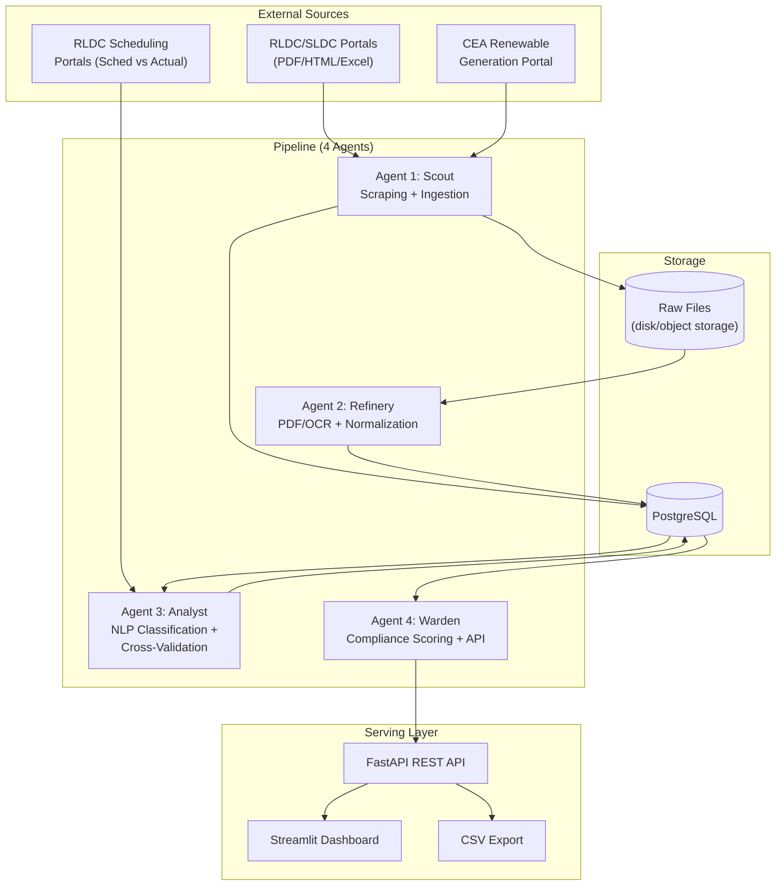

# Architecture.md — System Architecture

## 1. High-level component diagram



## 2. Data flow narrative

1. **Agent 1 (Scout)** polls the portal registry on a schedule, downloads new raw files, writes a manifest row per file into `raw_documents`, and stores the file itself under a content-addressed path.
2. **Agent 2 (Refinery)** reads unprocessed rows from `raw_documents`, determines PDF type (searchable vs. scanned), extracts fields via `pdfplumber` or OCR fallback, normalizes them, and inserts structured rows into `curtailment_events` with status `normalized`.
3. **Agent 3 (Analyst)** reads `normalized` events, runs the TF-IDF + classifier pipeline on the `dispatcher_remark` field to populate `predicted_cause` and `confidence_score`, then separately pulls schedule-vs-actual data and populates `deviation_mw` and `validation_status`.
4. **Agent 4 (Warden)** computes per-region compliance metrics into a separate `compliance_scores` table (derived, never mutates `curtailment_events`), and exposes everything through FastAPI endpoints.
5. The **Streamlit dashboard** and any external consumer talk *only* to the FastAPI layer — never directly to PostgreSQL.

## 3. Database schema (proposed, PostgreSQL)

### `raw_documents`
| column | type | notes |
|---|---|---|
| id | UUID (PK) | |
| source_url | text | |
| region | text | North/South/East/West/North-East |
| report_date | date | |
| format_type | text | searchable_pdf / scanned_pdf / html / xlsx |
| file_path | text | path on disk/object storage |
| file_hash | text | for dedup/integrity |
| downloaded_at | timestamp | |
| processing_status | text | pending / processed / format_unrecognized |

### `curtailment_events`
| column | type | notes |
|---|---|---|
| Date | date | 15-min block or daily date |
| State | text | |
| Region | text | |
| Demand_MW | numeric | |
| MaximumDemand_MW | numeric | |
| HydroGen_MW | numeric | |
| WindGen_MW | numeric | |
| SolarGen_MW | numeric | |
| OtherRE_MW | numeric | |
| RES_Generation_MW | numeric | |
| TotalGeneration_MW | numeric | |
| RE_Available_MW | numeric | |
| EnergyShortage_MU | numeric | |
| Curtailment_MW | numeric | |
| Curtailment_Percent | numeric | |
| Curtailment_Type | text | |
| Cause_Label | text | Grid Security / High Frequency / Commercial / ... |
| Dispatcher_Remark_Synthetic | text | raw extracted text (synthetic) |
| is_synthetic_label | boolean | True for synthetic modelled data |

### `compliance_scores`
| column | type | notes |
|---|---|---|
| id | UUID (PK) | |
| region | text | |
| report_date | date | |
| published_on_time | boolean | |
| publication_delay_hours | numeric | |
| completeness_pct | numeric | % of expected fields present |
| computed_at | timestamp | |

## 4. Why PostgreSQL over a document store

Curtailment events are fundamentally tabular and relational (event → source document, event → region, event → compliance score), and the project needs SQL aggregation for the dashboard (group by state, by cause, by month) and for the compliance scorecard. A document store would add complexity without a corresponding benefit here. See `Decisions.md` for the fuller rationale.

## 5. Deployment shape (semester-project scale)

This does not need container orchestration or cloud infrastructure to demonstrate the concept:

- **Local/single-VM deployment** is sufficient: PostgreSQL + FastAPI + Streamlit + APScheduler cron all running on one machine (or one free-tier cloud VM for the demo).
- **Object storage for raw files** can be local disk for the semester project; S3-compatible storage is a natural upgrade path but not required for FF180 evaluation.
- **No GPU dependency** — TF-IDF + Logistic Regression/SVM run comfortably on CPU, consistent with the synopsis's stated hardware requirements (8GB RAM, i5-equivalent).

## 6. Format-handling decision tree (Agent 2)

```
Is the file HTML?
 ├─ Yes → parse table directly (BeautifulSoup)
 └─ No → Is it Excel?
          ├─ Yes → parse directly (pandas)
          └─ No → Is the PDF text-extractable?
                   ├─ Yes → pdfplumber/PyPDF2
                   └─ No  → pytesseract OCR → flag lower confidence
```

This tree is what Agent 1's "format discovery" phase feeds into — the portal registry records which branch each source typically falls into, so Agent 2 doesn't have to re-detect format from scratch every time (though it still verifies, since formats do change).
